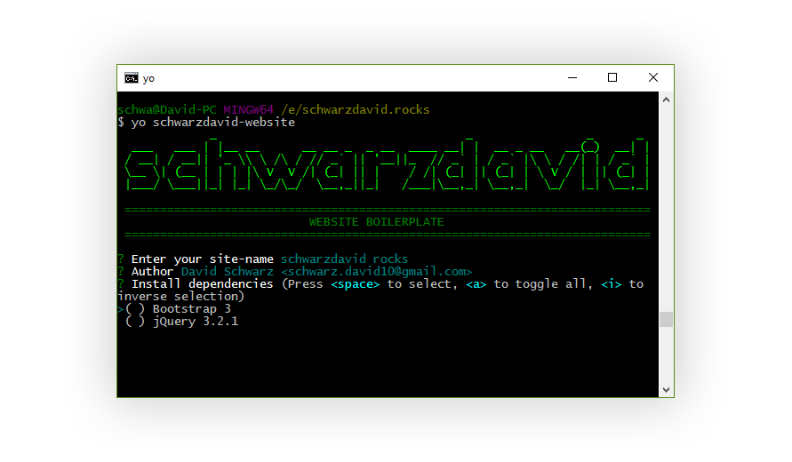

# Website boilerplate generator for Yeoman

> Generates a scaffold for a modern html 5 website with a working build system using gulp

## Install

In order to use this generator properly, you need to have `NodeJS`, `Npm` and `Git` installed aswell as `bower`, `yo` 
and `gulp-cli`. Make sure you have all those dependencies installed by running `npm i -g yo gulp-cli bower`. If you 
already have those installed, you wont install them twice when you run this command.

When you have all dependencies installed, you can run

**`npm i -g generator-schwarzdavid-website`** 

to install the package. Now go to your empty project directory and run 

**`yo schwarzdavid-website`**. 

The boilerplate will be created in the directory you are currently in and a git project will be initialized 
and all dependencies installed.

All you have to do now is to run `gulp serve` to build your website and start working.

Enjoy!

## Features

* Automatic less to css compilation
* Minify all css and js files
* Autodetect bower dependencies and inject them into html
* Separate tasks for developing and production
* Automatic optimization of all _.jpg_ and _.png_ files

## Commands

* `gulp serve` Runs `gulp build` and add a watcher to all relevant files. Whenever one of 
those files change, the build will be updated.
* `gulp build` Runs `build:less`, `build:js`, `build:img`, `build:vendor` and `build:html`
* `gulp build:less` Compiles your less-files to css, optionally concats them and outputs a minified _main.min.css_ file
* `gulp build:js` If in production mode, it concats, minifies all js-files and outputs _main.min.js_
* `gulp build:html` Injects all files into _index.html_, optionally minifies the code and removes comments
* `gulp build:img` If in production mode, minifies all images and removes meta information
* `gulp build:vendor` Concats and minifies all bower dependencies into _vendor.min.js_

## Todos

* [ ] Add JSLint to `gulp build:dev:js`
* [ ] Start Webserver at `gulp serve`
* [ ] Handle all html-files - not only _index.html_
* [ ] Extend possible dependency options
* [ ] Write tests
* [ ] Add Modernizr support
* [x] Add common files to .gitignore
* [x] Add babel to `gulp build:js`
* [x] Write sourcemaps